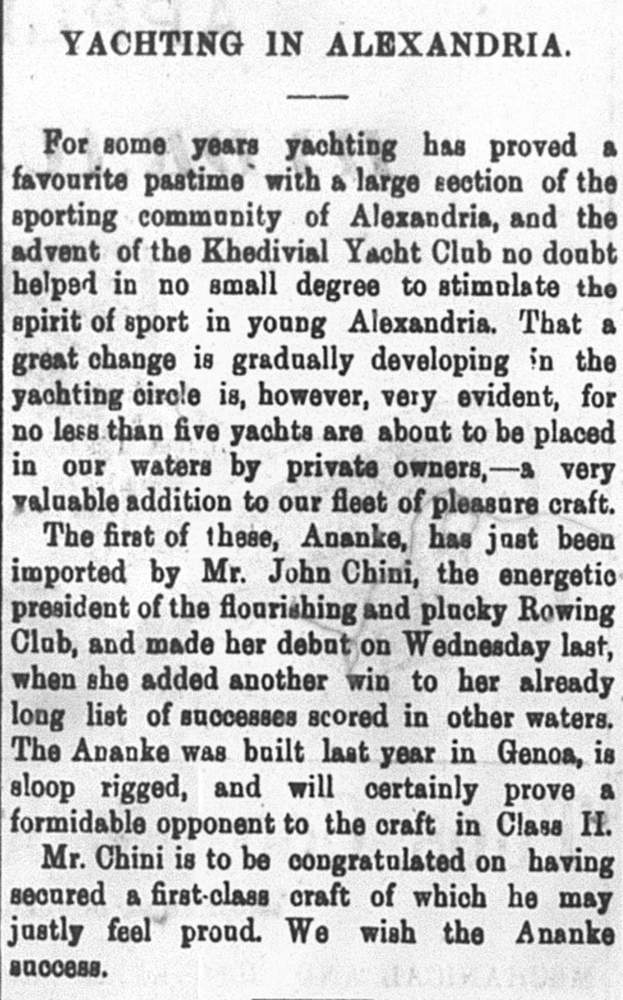
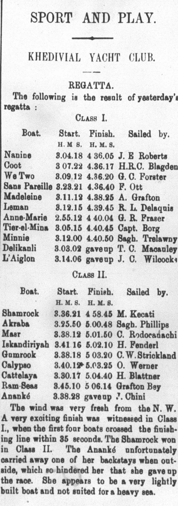

The Egyptian Gazette will occasionally feature a "Sport and Play." section, usually containing scores from  
cricket games. For the majority of this week, though, the section featured a regatta hosted by the Khedival  
Yacht Club. Unlike cricket, a regatta is a series of boat races, so I initially found its placement  
in the newspaper odd, until reading this sub article:

Yachting has apparently found an audience in Alexandria's sporting community, so much so that private owners with  
large money influences have begun to participate in races. (That is how I understand it at least.) I figured  
some additional research into these races was warranted:

1907 -- _The Motor Boat: Devoted to All Types of Power Craft_, Volume 4, Issue 12, by Francis P. Prial  
pg. 43: Prial mentions the waters near Alexandria and in Egypt in general as "splendid facilities for motorboating..."  
and how these waters were not receiving enough attention from craft owners.

Although the central theme in this source is motorboats, not yachts, I feel the source warrants mentioning because  
ideal waters might be a reason for the success that yachting in Alexandria had seen, and because the author also speaks  
highly of the Khedival Yacht Club.

1908 -- _Encyclopaedia of Ships and Shipping_, by Herbert B. Mason  
pg 328: A general definition of the Khedival Yacht Club: "Established 1902. Patron, H. H. the Khedive of Egypt ;  
Commodore, H.H. Prince Aziz Pacha Hassan...Entrance fee, £3 ; annual subscription, £2."

Based on the mention of an entrance fee, I assume that anyone could have participated in the regattas, and that the aforementioned  
private owners had the money to invest in elite crafts that could win races.

1907 -- _Fore'n'aft_, Volume 11  
pg. 62: The Khedival Yacht Club is hailed as "the only important organization of its kind in Egypt...  
and now has two hundred and thirty members and a fleet of fifty yachts. Weekly regattas are held in fort and numerous  
enjoyable social functions at the handsome club house."

To conclude, here are the results of the week in question's regatta:

The Ananke, a private-owned craft favored by the newspaper to win the race in its class, could not withstand the wind and  
waters that day, and had to forfeit the race.