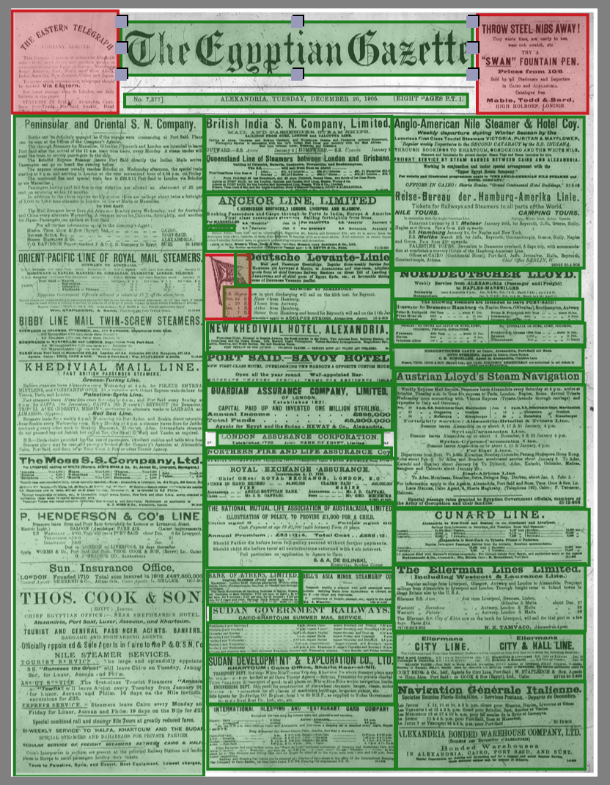

# Technical Difficulties

layout: page
subheadline: "Celita Summa"
title: "Technical Difficulties in the Egyptian Gazette"
teaser: "A brief summary of the struggles in encoding I've encountered."
date: 2016-10-06 <!-- date of post submission -->
categories:
  - XML
  - Encoding
  - OCR
author: CelitaSumma <!-- all one word -->
tags:
  - Technical Errors
  - XML
  - OCR
header: no
image: <--! for image-name.png, substitute name you've given your image file -->
  title: blog-images/EgyptianGazetteCisdemOCRConverter.png
  thumb: blog-images/EgyptianGazetteCisdemOCRConverter.png
  homepage: blog-images/EgyptianGazetteCisdemOCRConverter.png
  caption: Encoding the Egyptian Gazette has been a learning experience filled with obstacles.<!-- info about the image, such as date of issue -->
  caption_url: <!-- link-to-page-containing-text? -->>
---
When I first produced my image scans using the library's microfilm
of the Egyptian Gazette, I thought that by feeding the material into
the OCR software, my computer would automatically spit back the 
entire transcription completed error-free. At first I attempted to use 
FineReader on my roommate's laptop, hoping it would yield results, but
when her computer began to lag and I realized how time consuming the 
process would be, I switched to using my Mac. 

When the class discovered Cisdem PDF Converter for Mac, I quickly 
realized that while some pages contained minimal errors, others required 
extensive corrections to yield an accurate reading of the text.
The pages, most of which were rife with errors, took around 2 and a half
hours each to fully type and XML, and even then many advertisements and
charts are still not completed.

After I had completed the vast majority of the transcription, I learned
that by scanning in a higher resolution and stitching multiple images
together, I probably could have produced the paper and a much faster rate.

Nevertheless, I'm continuing to work on completing certain advertisements
and charts, as well as TEI-tagging people and places.

ext
