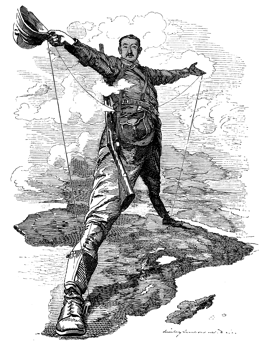
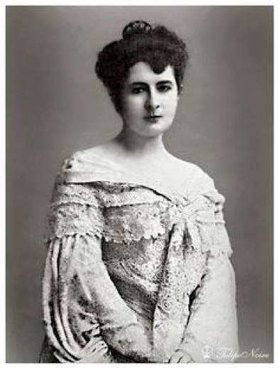

layout: page
title: "Egyptian Gazette Views on Imperialism"
teaser: ""
date: 2016-10-08
author: Celita Summa
tags: -imperialism-
image:
  header: "Khedivial Princess"
  thumb: "Khedivial-Princess.png"

Although there is a constant sense of British imperialism evident throughout the Egyptian Gazette, the attitude toward this imperialism varies widely throughout the
paper. For instance, there are many cases where the Egyptian Gazette provides long blocks of texts or ads clearly targeted toward rich Englishmen. The paper then proceeds to provide a sentence-long description of an  item or event important to African natives. This follows with the expected traditional convention of the paper, seeing as its intended audience was wealthy Westerners.

http://www.britishempire.co.uk/maproom/egypt.htm
However, it was rather surprising to discover a whole column’s length worth of information on a
book regarding the emancipation on Egypt. This article, in the December 26th issue of the
Egyptian Gazette, mentioned both sides of the imperialism conflict, saying the author “devotes a
whole chapter to the ‘false position of Great Britain in Egypt.’” The Egyptian Gazette also seems
to be an influential avenue for charity donations, frequently reporting on giving to certain causes
and being used as a means for donations.

The paper devotes an even greater amount of room to a cluster of articles surrounding the death of a khedivial princess. These articles discuss the death of this princess, who was the sister of Prince Omar Pasha and Prince Djemil Pasha Toussoun, as well as the wife of General Ahmed Djelaleddin Pasha. Her husband wishes to open an inquiry into the circumstances surrounding her death, documented in a French telegram that is also printed in the Egyptian Gazette. Throughout the collection of articles, the princess is never referred to by name, only as the Khedivial Princess.

Whether this great amount of detail is due to the shock value of the event or the genuine interest
in the matter by English businessmen is open to interpretation. Much of the Egyptian Gazette is still
written about administration, war, and other topics that would mainly be of interest to the white
population of Alexandria, but these few tidbits to the contrary were an interesting find.
