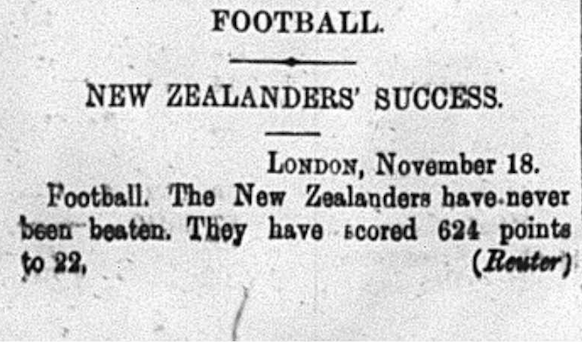

November 20, 1905 the Eqyptian Gazette posted a section about football at the bottom left corner of Page three.
The New Zealander Football team is the best of the best. In London, on November 18, as suspected, they won another game with the score of 624 to 22. This is a very odd fact because the game of football usually can not reach such high point counts.Unsure of why the score was so high, I began to wonder if "football" really meant the game of football...
In 1905, the New Zealander Football team was most likely a Rugby team. This is inferred by the time period of the newspaper, and also the location of Alexandria. Rugby is a form of football, but not the original game we play here in the States. The objective of Rugby is to carry and/or kick a ball over the other team's goal line. There are a few ways to score in rugby: try = 5 points, conversion goal = 2 points, penalty goal = 3 points, drop goal = 3 points. Being such small increments of points, it's questionable how the New Zealanders team scored 624 points in this game recorded in the Egyptian Gazette.
This area was known for there interest in sporting activities. Often, sporting events are mentioned in the Egyptian Gazette. This shows that the demand for sporting information and updates was at a high demand in the Alexandria area. The community, as a whole, enjoyed the sporting events and kept up with their favorite teams Win / Loss ratio through the Egyptian Gazette.

