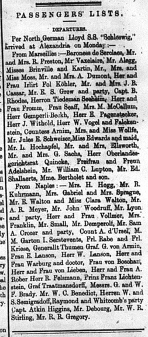

As I was going through and correcting the text of the Egyptian Gazette from Febrary of 1905, I noticed that at certain events, the paper gives long lists of names of people who attended.  They also do this with passenger lists, or who embarked on a ship, every week.  This sparked my mind, making me think is this community very closely knit to the point where most people would know a majority of the names that are listed?  Are the names on these lists just the highly recognized citizens, or is it a mix of everyone in the community?  The events that they list names for include, but are not limited to, arrivals, departures, visitors lists, guests at restaurants, dances, and even concerts.  As I analyze some of the lists, I look at the names and think that they must be only listing the celebrities, or important well known people of their day.  Then as I look at other lists, they seem like just a jumble of names that include everyone, popular or not.  These records of who attended events are quite lengthy, which makes me believe that these lists are composed of a mix of everyone in the community, and simply just lists all of the names that either depart or arrive on a ship that week. If this is true, then this community is not as closely knit as I was first lead to believe.  Im sure the citizens still recognized a lot of names from the list, but I do not believe that they are all close with each other.  

