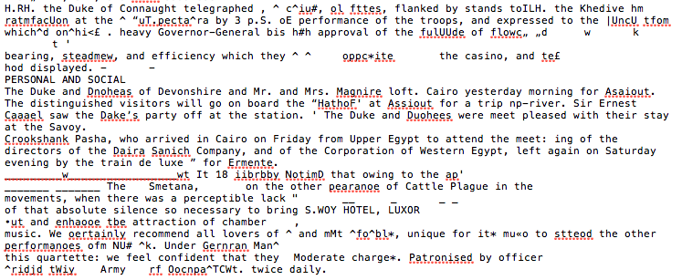

Over the course of this project, I have encountered a couple technical
 difficulties.  Most of them are just because I am not fully educated on the
 subject of markdown and xml, which are not too bad because I learn how to overcome
 them in class.  The one very troubling problem I run into over and over again
 is the ability of the OCR software to correctly recognize the text from the images.  When this text comes out of the OCR software it looks like a big jumble of letters and signals that in no way or shape seem to form words.  Due to this inability of the software, I spend roughly three or more hours typing the corrected text of each individual page.  This makes the hardest part of the class busy work, which is not what it is meant to be.  I feel that the hard part of the class should be tagging the text and learning all of the different tags, what they mean, and how to correctly use them.  I feel that if this class is to continue being held in the future, a better OCR software needs to be found and purchased so that the focus of the class switches from busy work, to learning and spending time working on the xml software and the tagging of text.

