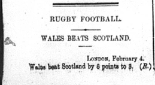

I am very interested in the sports that they used to play back in 1905.  I want to figure out what they played, where they played it, how they organized it, and how competitive the games between teams were.  In order to answer all of these questions I will have to look at the week to week wins and losses in their leagues from the Egyptian Gazette, and on top of that I will have to do a bit of background research outside of the newspaper and try to gather all of the information about 1905 sports that I can find. For an example I am going to use a cut out about a rugby game.  As you can see, all that it shows is the sport, rugby football, who played who, Wales and Scotland, where it took place, London, and the score of the game, Wales 6 Scotland 3.  I am going to take this information and check the scores every week.  I will then use those statistics to find out which team is the best and how competitive the teams in the league are with each other.  Other things I would like to find out include how they set up the games like refs, locations, playoffs, scheduling, etc. which I do not think I am going to be able to figure out by only using this text.  I will have to search the internet for anything involving 1905 rugby football and hope that I can find some information on this.

