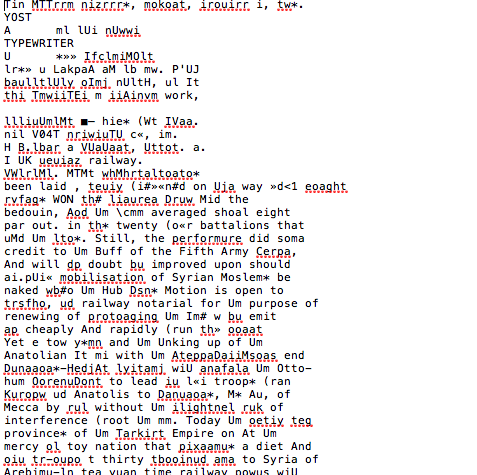

layout: page
subheadline: “Melizza Black“
title: “Difficulties with OCR”
teaser: “A short, very angry, very annoyed rant“
date: 2016-11-09 <!-- date of post submission -->
categories:
  - technical
author: MelizzaBlack <!-- all one word -->
tags:
  - OCR, Mac, Difficult
header: no
image: Difficulties.png
  title: blog-images/Difficulties.png
  thumb: blog-images/Difficulties.png
  homepage: blog-images/Difficulties.png
  caption: Example of an OCR conversion made by ABBYY FineReader
  caption_url: <!-- link-to-page-containing-text? -->>
# H1 Difficulties with OCR

One of the main goals in this class is to covert an old newspaper into a website that allows it to be easily accessed by anyone. In order to do this we must complete one very vital, and apparently very difficult step: covert pictures of microfilm into reader editable, text. This is called OCR (optical character recognition) and thankfully there are lots of programs available to us to make this process extremely simple, or so it’s thought. One of these programs is ABBYY’s FineReader, which was the one first suggested to us. This program apparently does wonders if you are using a Windows computer, but for us Mac users it only creates disappointment. Instead of converting our images into readable text, it converts them into an agglomeration of random characters that sometimes resemble words in the English language. I’ve provided a short example of one of these “conversions” done on the first few lines of one of my microfilm images. I’ve tried rescanning my images, making adjustments in FineReader, and tried a different OCR program to try and achieve better results and nothing has worked in my favor.  So, instead of making small corrections to the text as it should be, I am forced to basically retype the entire page. This process is **extremely time-consuming** and I am positive that if I had an OCR program that loved my Mac computer as much as others seem to love Windows ones, I would have completed much more of my work by now. 

