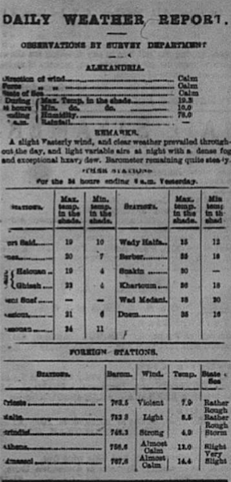

layout: page
subheadline: "Kara Hofmeister"
title: "Serial Question"
teaser: "Format Changing"
date: 2016-00-00 <!-- date of post submission -->
categories:
  - changes, boilerplates, financial tables
author: karahofmeister <!-- all one word -->
tags:
  - tag
header: no
image: <--! for image-name.png, substitute name you've given your image file -->
  title: blog-images/image-name.png
  thumb: blog-images/image-name.png
  homepage: blog-images/image-name.png
  caption: <!-- Image is from January 4 page 2 and is of the Daily Weather Report -->
  caption_url: <!-- link-to-page-containing-text? -->>
---
#Why is everything different
While working on my pages for the newspaper, I continually ran into issues regarding the
financial tables. Almost every single one of mine was very different from the
templates provided and it was super frustrating and time consuming to change them all.
Because of this, my serial question for the project will be the following:
How does the format of financial tables change throughout the year?
To do this, I will look at the financial tables of numerous issues from different months,
particularly the daily weather reports and stock exchanges because those are the ones
I noticed the most differences in for my issue. I will write about the discrepancies
and use pictures of the financial tables to show the difference. This project will
show how the newspaper evolved throughout the year. 

