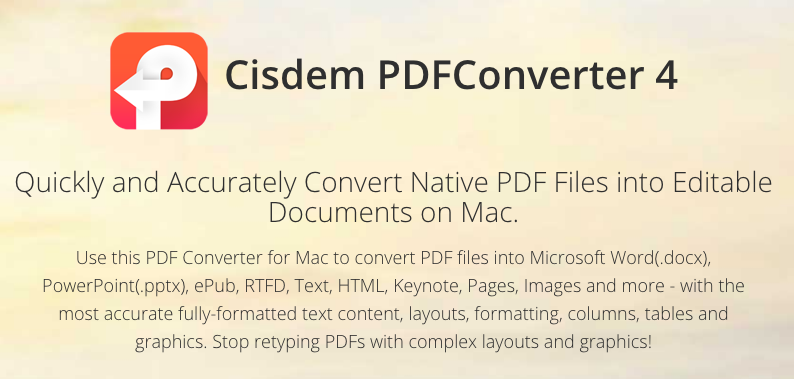

For my technical reflection, I have decided to discuss my experiences with the
OCR software, simply because it was easily the most time-consuming and tedious
portion of the technical aspects of this class. Since I have a Mac laptop, I
used the Cisdem OCR software rather than ABBY Finereader.

The first thing I would like to say is the accuracy with which it translates
the text is quite disappointing. I would estimate that at MOST 60% of the
original text was transcribed to my text editor properly, and even more
frustrating was that specific letters were nearly almost incorrectly written,
for instance the letter “e” for the entirety of the respective pages was often
incorrectly recorded as the letter “a”, and vice versa. Furthermore,
spell-checking entire pages written in French was both lengthy and difficult,
particularly when I could not read some of the words and could not use context
clues to figure out what they were supposed to say (because I do not speak
French). At a certain point I had to simply accept that my XML pages were simply
going to be filled with egregious errors and a certain level of accuracy was
impossible to achieve (much to the chagrin of my mild OCD, but hey it was a
learning experience in patience and Zen).

Overall, I was not a fan of the OCR software. It was most likely faster than
manually transcribing entire pages of the newspaper, but it was nonetheless
aggravating and stressful. Rant over.

