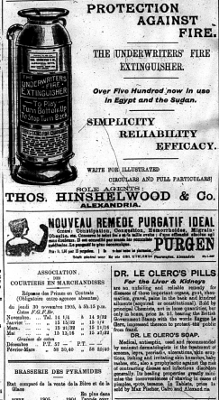

During my week of the Egyptian Gazette, I have several page sevens that are unlike the other pages. These pages focus on travel and mostly have hotel advertisements. However, they also contain commentary about the best way to travel to different places and the differences in climate between the two. This commentary is split between all six columns of the newspaper. There are some  that are similar in that they take up two columns. However, I have no idea how to encode these page sevens in order to reflect the structure of the newspaper. Up till now, I have just grouped the commentary in one div. If I encoded the page sevens by columns, I would get six random groups of text. Obviously, this would cause a great deal of confusion unless there was a way to connect the text in each column together. A tag that connects the text together might work, but this issue is definitely one worth exploring as we move forward.
