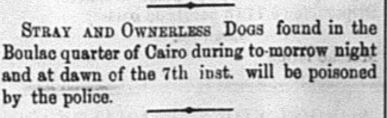
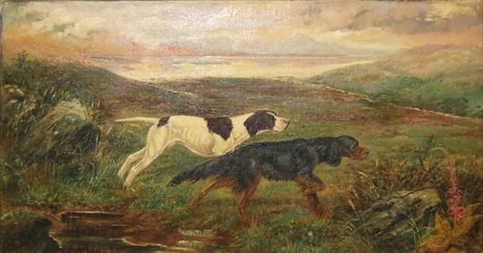

#Dogs Sentenced to Death
In some of the issues, under the “Local and General” section of the paper, there are sometimes small articles labeled “Stray and Ownerless Dogs,” which is a report of the dogs that have been found that day and where there were discovered. The snippets also always say that the dogs are to be poisoned if not collected. I find this section of the newspaper interesting because it is the announcement of very miniscule news. I find the local and general portion important because it shows the minor details that occur in the day-to-day lives of the citizens of Alexandria. It’s interesting to compare the way animals are talked about in 1905 as compared to now. [In 1905 animals](http://www.americanhumane.org/about-us/history/) were viewed mostly as an [agricultural resource](https://books.google.com/books?id=kn9xAAAAIAAJ&pg=PA214&lpg=PA214&dq=treatment+of+animals+in+1905&source=bl&ots=bOPeHYezYT&sig=Ew1RbTvDBxKcu8IgZF0b9YwgfZ4&hl=en&sa=X&ved=0ahUKEwi8v7TIl8rQAhUBEGMKHc73A4gQ6AEIJzAC#v=onepage&q=treatment%20of%20animals%20in%201905&f=false) rather than house pets, like how we use them now. Dogs were not valued as greatly as they are now. In 1905, [the poisoning (and drowning)](https://books.google.com/books?id=2189AQAAMAAJ&pg=PA609&lpg=PA609&dq=why+were+dogs+poisoned+by+police+1905&source=bl&ots=f2oUZReMBt&sig=zgJ_Y7hHagKLWJyaSBzxSvfPVZA&hl=en&sa=X&ved=0ahUKEwiDvPzgmcrQAhVCqFQKHQQJAQ8Q6AEINDAE#v=onepage&q=poisoned%20dogs&f=false) of dogs was common and is expected to happen if dogs are found stray and are not claimed. This section may be useful because people could potentially have their animals returned to them, although the declaration of their poisoning is slightly depressing, it is fascinating that it is mentioned in the paper.

    
