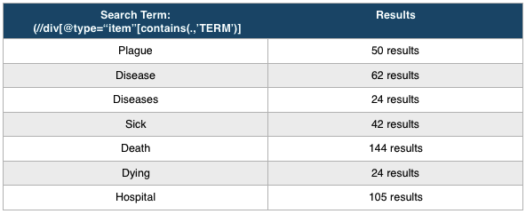
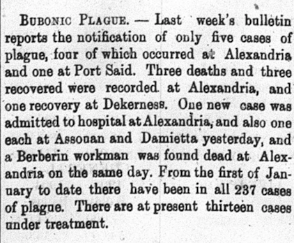

# Disease Occurance In Egypt in 1905

The purpose of this blog is to investigate a serial question within the Egyptian Gazette. The serial question should
discuss a pattern of information that is found throughout the year. My quesion of interest surrounds various diseases that were
present in Egypt in the year of 1905, and perhaps a more narrow focus can then be geared toward the 
most prevalent disease found in this area at this time. So the serial question(s) could be, "What kind of diseases were prevelant in Egypt
during this time-period? Does any one disease stand out in particular?"

To find this information, a search of other classmates work on the Egyptian Gazette will be conducted in order
to find as much information possible on the diseases presented by this newspaper. It is important to note 
that due to space and limited knowledge of the time, many diseases may not have been reported to, or
expressed by, the egyptian Gazette. Information is also limited to how well students have transferred the digitized
newspaper to .xml in Github.

What do I hope to achieve with my serial question?:

First, I would like to have a solid amount of information about diseases in Egypt within the time period of 1905. In order to
obtain this information, the cumulative work of other students will need to be gathered within the course content and gleaned over. 
I would like to then gather this information and present it in a visual way for others to easily understand. Information within a visual
graph should show people what diseases are prevelant in this area, at this time and observers should be able to determine easily which
diseases were most prevalent.

Issues:

There are some hiccups in the way. Some work done on the website may not have been coded properly, or it may have been coded in different
ways which return different results during a search. This creates a problem when using the search function XPath Query. This query searches 
the cumulative work of all students in regards to the entire year of 1905, within the Egyptian Gazette.

An example is as follows:

The above image shows many results for various search terms. Searching for diseases within the Egyptian Gazette requires multiple
search terms. For instance, a search of "disease" may yield different results compared to "diseases". Another issue is sifting through
information that is not relevant to disease: a search of the term "sick" may return two results 1) "I am sick of these hot summers," or 2) "I
have a friend that is sick from the flu." These two results clearly have different uses of the word and as a result, requires the observing
student to read each item in question.

This final project will be interesting as well as difficult.

