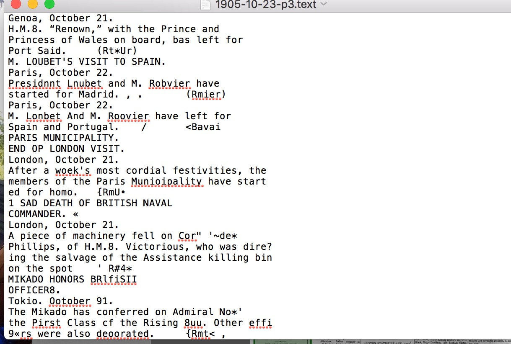

<?xml version="1.0" encoding="UTF-8"?>
---
layout: page
subheadline: "Johanna Eugenio"
title: "Difficulties with Converting images into XML"
teaser: "Some technical difficulties I have encountered converting The Egyptian Gazette images to xml files."
date: 2016-11-28 <!--- date of post submission --->
categories:
- technical 
author: JohannaEugenio <!--- all one word --->
tags:  
- Techincal
- XML
- Cisdem PDF Converter 
header: no
image:  <!--- for image-name.png, substitute name you've given your image file --->
title: blogpostimage
thumb: blogpostimage
homepage: blogpostimage
caption: October 10, 1905 <!--- info about the image, such as date of issue --->
caption_url: <!--- link-to-page-containing-text? --->
---
The biggest difficulty I have encountered is converting my Egyptian Gazette images into the XML format. After scanning my issues of the Egyptian Gazette I then used the Cisdem PDFConverterOCR to convert my images into text files. After doing this I noticed many errors within my text file and it took me hours to edit one page, sometimes causing me to retype the entire page. Most of my text file would be random letters or symbols that were impossible to decipher. 
After retyping many pages I learned about rescanning photos and the stitching process. I then used this method to rescan my image files and as for the Cisdem converter this made the images more clear and the text came out more fluent but there were still errors but not nearly as much as before. Due to the several errors I have in my text files it has slowed down the entire process for me. I believe I have spent most of my time working on fixing the text. Once moving past this portion I was able to get into more interesting things and was able to add tags and organize my XML files.
I believe if I had understood the stitching process sooner I would have saved myself hours and would not have had to retype pages entirely. However, once I progressed past this portion of the work I noticed that ad pages were much easier and took less time. 

