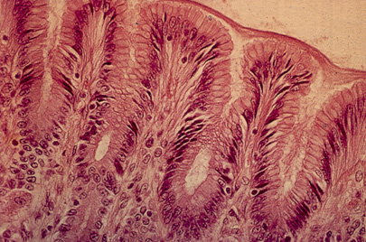

<?xml version="1.0" encoding="UTF-8"?>
layout: page
subheadline: "Johanna Eugenio"
title: "Enteric Fever"
teaser: "This blog post is about Enteric fever and the army."
date: 2016-11-28 <!--- date of post submission --->
categories:
- curiosities
author: JohannaEugenio <!--- all one word --->
tags:
- Enteric
- Army
- illness
header: no
image: <!--- for image-name.png, substitute name you've given your image file --->
title: blog-images/enteric-diseases.jpg
thumb: blog-images/enteric-diseases.jpg
homepage: blog-images/enteric-diseases.jpg
caption: Enteric Diseases, October 25, 1905 <!--- info about the image, such as date of issue --->
caption_url: <!--- link-to-page-containing-text? --->
---

While reading through the Egyptian Gazette issues I was assigned, I came across an article that has to do with Enteric Fever. This article intrigued me because I was no familar with the disease. After reading through the article it sparked my interest and I began to look up what this disease was. I found out that Enteric Fever is also known as Typhoid Fever. This illness is associated with Salmonella typhi bacteria. After reading more about it I realized that Typhoid is caused by bacteria that is similar to Salmonella. This article discusses how it is important to carry out preventative methods for this disease in the army. In then goes on to explain that the health efficiency of the Army has been increased by a lot. They talk about how they encourage men in the army to have better hygiene in hopes for better overall health. I think this is interesting because the article discusses the different types of methods they use to prevent the disease, such as boiling drinking water. It is interesting to see the medical advances for this time compared to current time. Enteric is such a big deal during this time and the prevention of the disease is so important, however as of now I had not even recognized this disease until I read further into it. 

