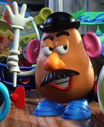

Remember that crappy day you had, like yesterday? or how about the time you lost your phone for an hour? Those were horrible times, but at least you didn't lose your favorite arm like Baron London Bavastro de Cortazzi.

It all started over a dispute over an allegedly unpaid bill at a hotel while in the United States. He had gotten into an argument with the proprietor of the Grayson Hotel and in anger he barged out and forgot his arm in a trunk that he had left. Realizing his mistake he went into the hotel and tried to retrieve it, only to get arrested (damn Americans). Now you're thinking that it's only just an arm, I mean what does an arm really do, but you don't understand how pristine this arm is. It is described by the Egyptian Gazette as "Probably no better left arm can be found in this country than the one which the Baron had. It is almost human, although it is made of papier maché, aluminium, steel and wax." They also state the usefulness saying, "The hand of it could twirl a cigarette, write checks and carry a cane". That is the equivalent of losing an Iphone 7! Not only does the baron have to deal with his lost arm, his arrest, but he also has to deal with being a witness to the death of one his friends.

Along with all of this the newspaper seems to be mocking Baron de Cortazzi, they take the upmost pleasure in using puns to describe his ordeal, "His heart is in Egypt", "he declares that his neck has felt the heel of the oppressor", and "through various legal complications he has nearly lost his head". Talk about a crappy day.

But on a serious note who is Baron Cortazzi?
Baron Cortazzi was a man who was testifying about a murder that happened to Mrs. Blanche Turner Dennis. His dad apparently owned estates in Egypt and was friends with Arlbett Sackey. His dad must have known some important people because he met Sackey through an unnamed high official in Egypt. He stated that Mrs. Blanche Turner Dennis was Sackey's fiancée. Baron Cortazzi said that Sackey beat her once and that she may have died from that beating. No other reports could be found of Baron Cortazzi even through x-path query.

It is important to note that Sackey denied any role in Mrs. Dennis death and that someone else was accused of her murder.

