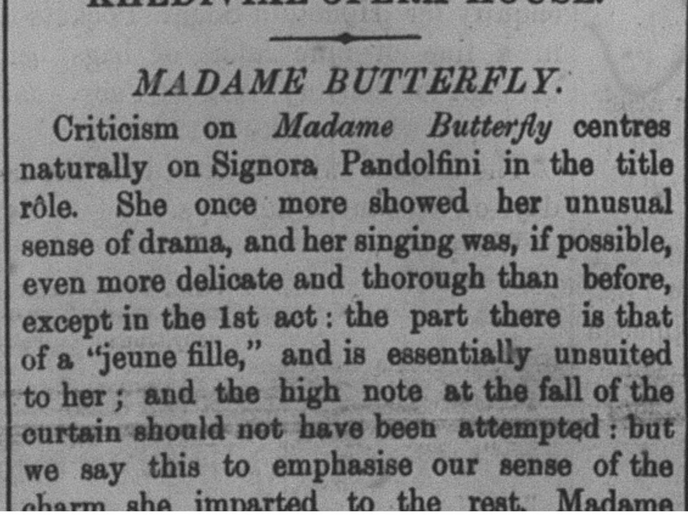
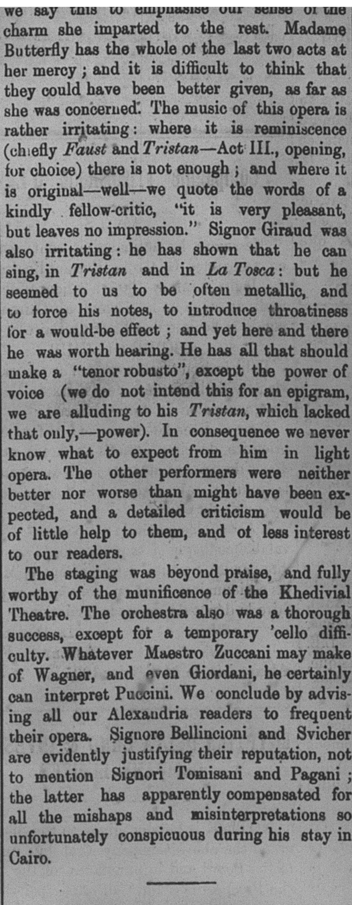

The lights dim and slowly, the onlooking crowd goes quiet with growing
anticipation. The excitable people among the bunch murmur about their
excitement to see Signora Pandolfini for their first time as they prepare to
hear her sing a soft melody. The people gushing with anticipation hurriedly
tell them to shush as they do not want to miss the moment her voice first
chirps. The curtains open and just as fast, the tale begins. It’s poetry in
motion… sort of. If the crowd’s reaction was anything to go off, Pandolfini
really missed the mark on the first act of [Madame Butterfly](http://www.musicwithease.com/puccini-butterfly-story.html),a relatively well-known play back in the early 1900s and
even now. Back in the early 1900s, the performance had been making the
rounds across America and Europe, and it soon found a troop to replicate its
excellence in Egypt's [Khedivial Opera House](http://www.cairoopera.org/history.php?lan=En) … for the most part at least. Pandolfini managed to win
the crowd over in acts two and three, but the long-awaited play certainly
had more than one mishap. While the symphonies played were engaging, many
critics said that it left no real impression. This does not equate to bad
though, as these same critics believed that the play was truly worthy of
playing in the Khedival Theatre.

# Source of Interest
 Attached here is the act by act synopsis of [<hi rend="italic">Madame
 Butterfly</hi>: http://www.columbia.edu/itc/music/NYCO/butterfly/synopsis.html
