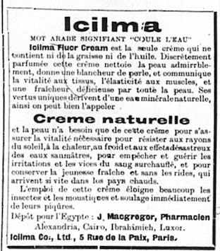

# Icilma

To begin, the name Icilma came from combining the Arabic words ‘icil’ meaning flows and ‘mha’ meaning water.  It was Stephen Armitage who founded Icilma in 1898. He was a civil engineer who found the use in mineral water from a natural spring located in Algeria. Originally wanting to open a spa near the spring, Stephen was moving from city to city trying to sell this mineral water in any way possible. He moved from Algeria to Paris and later growing his product in London. Finally settling in London, he established the business “Nature’s Remedy Company” where he not only worked as a chemist, but also built the machinery that went on to create Icilma cream. Icilma cream then transitioned into Icilma Flour cream due to the Calcium fluoride present in the water. It was later known and advertised as ‘Nature’s Skin Food’. Not only did it heal and prevent blemishes, and blackheads, but it was also a great product for healing mosquito and insect bites as well. It was sold as both a face powder and a soap.

