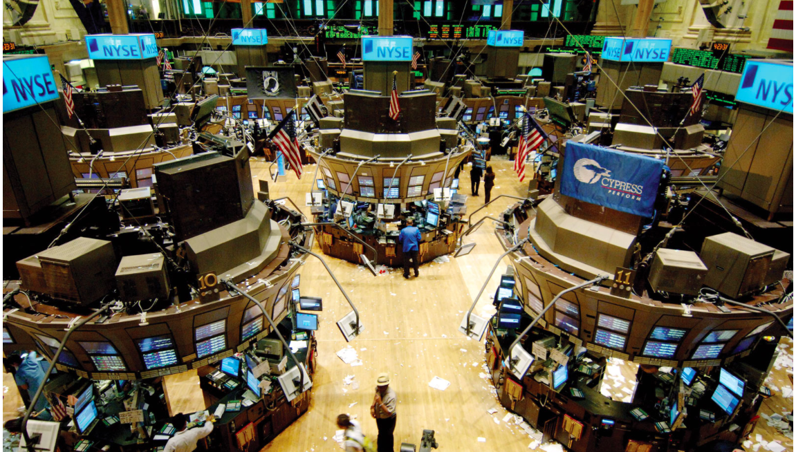
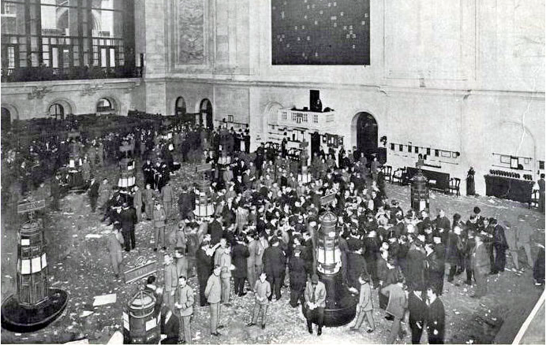

# Economic Curiosities
## "Jackson Boucher"
### Economics, stock exchange, page 4s, prices, export manifests

As a Business Finance major here at FSU, numbers and trends always interest me. Tracking monetary exchanges and learning about the mediums through which they happen can reveal a vast amount of information about the world we live in. The same can be said about the world over a 100 years ago, when the Egyptian Gazette was being published in colonial Alexandria. What types of products people, firms and countries buy and sell shows researchers how advanced societies were, what their priorities as a population were and if they are prospering. In modern times, economic strength and growth is mostly reflected on stock market indexes and averages. Trillions of exchanges happen everyday over dozens of major exchanges across the world. Although stock and bond trading had existed well before 1905, I am interested to know how big of a deal stocks were to most people. The 2008-2009 stock market crash affected almost every person in the world. Unemployment, gas prices and government programs all worsened, as people criticized all those who, they believed, were at fault. Television, newspapers and other media outlets could not go a single day without reporting on the financial crisis. Obviously, there was not a major stock crash until the Great Depression, but I’m interested in learning how big a deal stock/bond prices and market conditions were to your average Egyptian who was alive in 1905. I want to know if people closely monitored the stock and bond prices, future prices and export manifests that were reported in the Egyptian Gazette in a similar way to how modern Americans watch the news and read indices like the Dow Jones and NASDAQ averages.

New York Stock Exchange in 2016

London Stock Exchange circa 1900s
