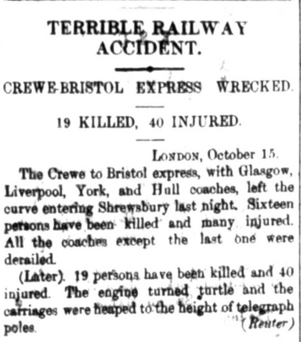
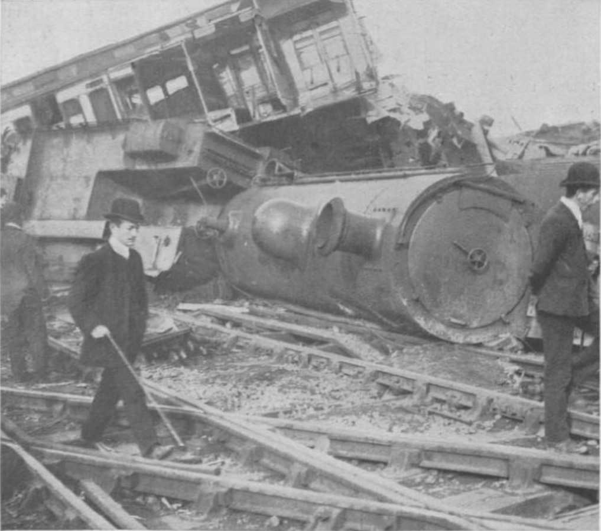

---
title: "Sleepy driver results in fatal accident"
subtitle: ""
summary: "Crewe-Bristol Express Wrecked, 19 killed, 40 injured."
authors: [peytonsmith]
tags: ["train", "death", "London", "railway", "wreck"]
categories: [curiosities]
date: 2019-10-22
featured: false
draft: false
image:
  caption: "Screenshot of the incident in the Egyptian Gazette newspaper, October 16th 1907, page 4, under 'Telegrams.'"
  focal_point: "Smart"
  preview_only: true
projects: []
---   
One incident that I found very curious to research upon was one that I found in my Wednesday issue, in the Telegrams section that writes about an accident that happened in a town named Shrewsbury, located in the Mid-west part of England. As a train was traveling from Crewe to Bristol, it got into this accident in this town located right in the middle of the two cities and resulted in the death of 19 and injured 40.  

 
  
 Although the incident occurred, the cause of what happened is still uncertain. In an article, found [here](https://www.revolvy.com/page/Shrewsbury-rail-accident), the officials at the scene examined the driver, and found out that he was not intoxicated nor under any influence of drugs, making the situation even more difficult to pinpoint. In another article, found [here](https://www.shropshirestar.com/news/nostalgia/2017/10/14/sleeping-driver-mystery-of-shropshires-worst-crash/), they have another spectulation on why the incident came about, many officials believing that he was sleepy. The article reads: 
> The upshot was that approaching Shrewsbury, sleep overcame him. He passed Harlescott crossing and Crewe Bank without knowing it, and did not see the signals at danger, and on the downward gradient coming in to Shrewsbury the train picked up speed rapidly.

The incident itself, even after 100 years, is something to always keep in mind. From [another article](http://news.bbc.co.uk/2/hi/uk_news/england/shropshire/7044176.stm), a member of the Shrewsbury Railway Heritage Trust, Dave Giddens, believes that the incident should never be forgotten. In his own words he says:

>"It's very good, even after 100 years to still remember the people who were involved in it and the people that lost loved ones,"

In comparison, there are other incidents in the Egyptian Gazette that also involves train crashes, in one [blog post](https://dig-eg-gaz.github.io/post/18-blog-clark/) by Gavin Clark, another incident involving a train accident was published in the newspaper in 1906. But instead of it being an actual crash, the train caught on fire. In another [blog post](https://dig-eg-gaz.github.io/post/2017-03-06-story-theuntimelydeathofprincemohamidibrahim/), made Will Hanley himself, entails an incident where a Prince was killed in an unusual car accident as he was hit by a train. Just from this, it can be concluded that train safety has definitely advanced in the 100 years. Nowadays, you rarely hear of a train crash, resulting in the death of people, where back then it seemed as if this was a common occurence.

Lastly, one might ask "Why would a train accident be newsworthy in an Egyptian newspaper?". The answer is simple, Britain took control over all parts of Egypt back during the time this was written. Acting as a protectorate under British rule, this lasted from 1886 to 1914. Because of this, it was very common to find British news all throughout the contents of the "Egyptian Gazette," where the editors themselves were often at times British. At the same, for this incident specifically, it was located in the Telegrams section, where they report news from all around the globe.

