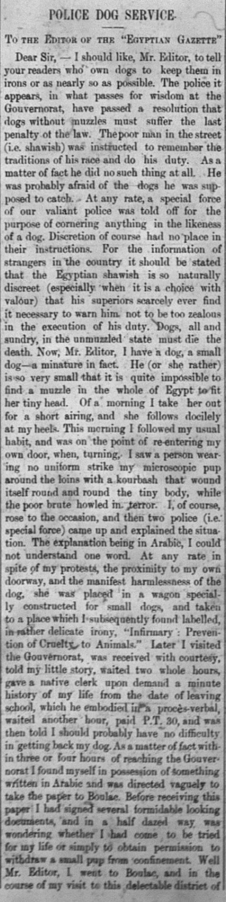

As I was completing my deliverables and combing through page images, I came across an interesting article in the "Letters to the Editor" section of the June 14, 1907 issue of the _Egyptian Gazette_. In this article, an individual described their experience in which their gentle dog was harmed and seized, right as they were about to get into their home, simply because it was not wearing a muzzle. In this time in Egypt, it was required for dogs to wear muzzles in public, but this individual was not able to place a muzzle on their dog because it was so small and no muzzle would fit it. The typical punishment for dogs not wearing muzzles in Egypt was death. As this individual went through the process of getting their dog back, they witnessed a vast area and said it was "like searching for pins in the Catacombs."

The treatment of dogs in Alexandria was completely different than the treatment of dogs in today's society. Today we treat dogs as if they are our own children and only muzzle them if they show aggressive tendencies. In Alexandria, if any dog, no matter how small, nice, or cute, was seen without a muzzle in the open, the police would hit them, or kill them, and even seize the dogs and contain them in an ironic facility labelled the "Infirmary : Prevention of Cruelty to Animals." The individual that submitted this letter did not understand Arabic, so they could not understand what two police officers were trying to tell them before the writer's dog was seized or even the papers that needed to be signed before the dog went back into the writer's custody. This type of treatment would not be accepted today in the United States since pets have become so near and dear to humans. Pets are now even ironically used as police dogs all around the world, contrary to the letter that discussed how police were abusive towards dogs.

In this [blog post](https://dig-eg-gaz.github.io/post/18-blog-degroat/), someone discussed this same letter, "Police Dog Service" and stated that someone responded to this letter agreeing with the writer and stating that dogs should be treated better, especially as they get closer to passing away. However, in this time period in Egypt, dogs were not commonly thought of as dearly as they are now, so they were kept in terrible conditions and left to die a horrible death. In another [blog post](https://dig-eg-gaz.github.io/post/16-analysis-sain/), I saw even more evidence of how dogs were yet again mistreated and not cared about as much as they are today. The creator of this blog post mentioned that they discovered that there was a section in the _Egyptian Gazette_ titled "Stray and Ownerless Dog" that provided little information on the actual dog and when they were set to be poisoned. In this time period in Egypt, if dogs were found and did not seem to have an owner, a vague announcement was made and as a form of controlling the overpopulation of dogs, they were euthanized right as they were caught. Today, we provide owners with a longer time to find their lost dog and if a dog does not have an owner and is in a no-kill shelter, workers at the shelter try their hardest to advertise the dog so that it can find a loving home. This is interesting because we can see the development of the relationship between man and man's best friend in the United States in the early 1900s and Egypt in the 1900s, Americans have domesticated dogs and thought of them as family members whereas Egyptians saw them as a hassle and pests. According to an [Online Blog](https://blog.biodiversitylibrary.org/2017/07/cats-dogs-nineteenth-and-early-twentieth-century-perspectives.html), during the nineteenth and twentieth centuries dogs were still not as near and dear to individuals as they are now. Dogs were kept mostly for completing tasks such as hunting, not usually for enjoying their company and having a companion.

Through reading these blog posts about how dogs were mistreated in twentieth century Egypt, I decided to conduct more research to see if the treatment of dogs has improved today in the twenty-first century. I first found an [Egyptian News Article](https://www.egypttoday.com/Article/1/3793/Gov%E2%80%99t-poisons-1K-stray-dogs-in-3-months-denies-shooting) that discussed the cruelty of the Egyptian government towards dogs. Since Egypt is overpopulated by dogs, the government poisons the food by stray dogs and leaves them to die and lay in the street. There have even been rumors that the Egyptian government has shot dogs and lets them lay in their own blood on the ground. Through reading this Egyptian News Article, it is obvious that Egyptians in the twenty-first have the same disregard and cruelty towards dogs as Egyptians in the twentieth century. In this [Article](http://citeseerx.ist.psu.edu/viewdoc/download?doi=10.1.1.913.7476&rep=rep1&type=pdf), a positive light is shed on the relationship between Egyptians and dogs as it highlights the useful tasks that dogs helped humans with. According to this article, dogs were seen as very productive in the Egyptian community because they assisted with hunting, protection, and herding livestock. Contrary to the writer of the "Police Dog Service" article in the _Egyptian Gazette_, this article on the relationship between individuals and dogs in Egypt states that "ottoman officials indeed actively encouraged the increase and maintenance of dog populations by providing them with food and water and by punishing those who committed violence against them." This is very surprising and ironic, considering that the "Police Dog Service" article literally stated how someone harmed an innocent, miniature dog due to it not having a muzzle. These differing opinions could possibly be due to different cities in Egypt having different policies and opinions on dogs.

