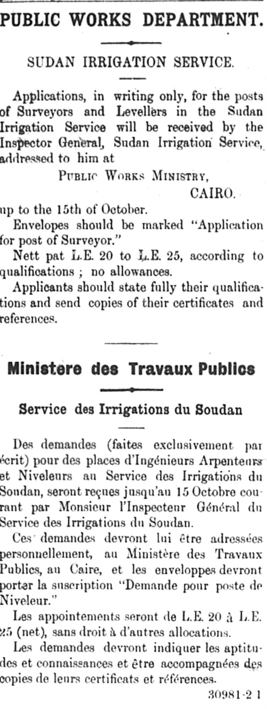

The [Egyptian Gazette](https://www.loc.gov/item/sn85054027/) is the newspaper of Alexandria, Egypt. The majority of the newspaper is printed in English with some sections printed in French. This is very interesting as the newspaper is disbursed in Egypt. Most people in Egypt speak Arabic, their official language, or at least similar dialects of it. The English Language has become a very commonplace form of communication all over the world, but at the beginning of the 20th century it is very interesting to find an Egyptian newspaper to be dominant in the English language, let alone pieces of French as well. [Egyptian Arabic](https://www.graphicmaps.com/egypt/languages) is widely known and popular in most parts of Africa, Europe and Asia, making up almost 75% of the populations first language. But the common tongue of Egypt has been dramatically influenced by the English and French cultures mainly due to tourism. This influence has caused the Egyptian Arabic that many are accustomed to, to be modified over the years to more closely rooted to [English and French](https://www.britannica.com/place/Egypt/Languages). This cultural adaption has made the Classical Arabic more efficient.

