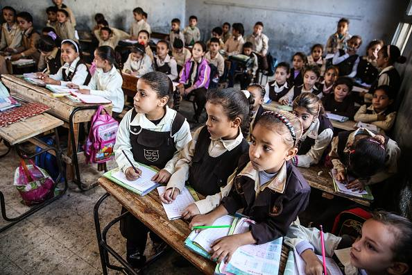

####The Shift in Education in Egypt
I decided to research the word “education” from the whole contents of previous issues. In the history of the education in Egypt, I learned that just as I thought, schools were only for boys (1905-09-26), and all thy learned was the basics of their religion until they finished and took the trade or possession of their father [Research more on this!](https://www.jstor.org/stable/3443092?seq=2#metadata_info_tab_contents). I came across and was impressed to see the small bits that came up. While I was expecting there to be education mainly for men or higher public figures, but actually found that education is important to the people of this time in this area, and education for orphans, children of the lower classes, and even young boys (making more elementary schools)(1905-04-14). There are even scholarships being offered, as seen in 1905-05-06, and there is desire to keep improving the educational standards of years to come, and desires to make use of the educational facilities such as the "Museum," one of the most famous schools in Alexandria (1905-04-12) [Research more on this!](http://www.copticchurch.net/topics/patrology/schoolofalex/I-Intro/chapter1.html). In 1905-01-12, it is stated that Medicine, Law, and more liberal studies were professions that people strived to improve in. In it is celebrated that parents are allowing their daughters to receive primary education (1905-06-06 and 1905-07-12), and it is said that men who are educated want wives who are educated, too (1905-12-20). This time period seems to be the time for advancements in education in which fund are being put out to make educational buildings, everyone is beginning to get an education, and education is valued. At this time in Egypt, education has made tremendous improvements like an increase in the literacy rate and by a drop in the number of kids outside of school, but still faces some challenges such as the size of school not being able to accommodate the amount of children in Egypt and social issues arise in schools that get in thee way of the higher education of students [Research more on this](https://wenr.wes.org/2019/02/education-in-egypt-2).

If you want to include other images, add the image file to the folder containing this file, and use this format:

