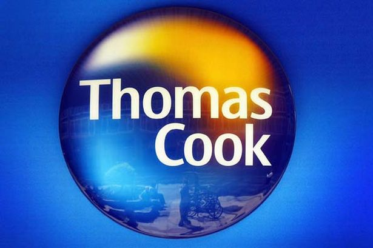
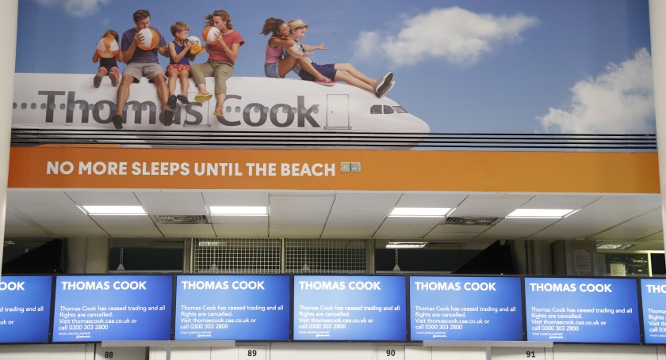

Thomas Cook was an English businessman. He starts up his business from a small local shop in London. The shop sold traveling related products such as guidebooks, traveling wears, and maps. Several years later in 1872, he expanded his business with his son John, reformed the company as “Thomas Cook & Son”. [[1]](https://www.telegraph.co.uk/travel/tours/history-of-thomas-cook/) 

Throughout the course, we found Thomas Cook & Son travel company has frequent updates on their advertisements. And they also sponsored the Egyptian Gazette profoundly from the title page banner. The companies had various travel package options in the Middle East. It was the early age that civilians could afford the expenses and take ships to another continent. In parallel to the analysis of advertisement on the Egyptian Gazette by Olivia Evanoff [[2]](https://dig-eg-gaz.github.io/post/16-analysis-evanoff/), she wrote that 
> people could “pay the fees that go along with it” in that period. 
It is plausible the early 20 Century is prosperous era in economy. As the company grew, it also owned hotels in Britain primarily, Western Europe, North America, and Middle East. Suggested by a blog post by Kailen Chapple [[3]](https://dig-eg-gaz.github.io/post/18-analysis-chapple/), the company had an enormous impact in the 19th Century. 
> It is “a new concept…a product of the industrial revolution.”

However, the glory of this family business could not survive with the competition of the travel markets in 2019. Nowadays, people have more options for traveling. They gradually not rely on package-tours or travel agents. The way people used to travel is changed since it becomes more accessible and easier to go foreign places without agents. Thomas Cook & song failed to transfer its tactics with modern travel behaviors, was defeated by other LCC (low-cost company) airlines competitors. [[4]](https://www.reuters.com/article/us-thomas-cook-grp-investment-explainer/thomas-cook-collapses-why-and-what-happens-now-idUSKBN1W804O)It was brought in low due to its 2.1 billion U.S. Dollars debt. The bankruptcy also interrupted approximate 500 thousand travelers’ plans. And about 30 thousand lost their jobs. Here is a footage from a pilot of Thomas Cook Airlines [[5]](https://www.youtube.com/watch?v=rGyd8jtroHo). The company sinks into debt, but its employee tries their best to serve their passengers with professionalism. 

Though it is the oldest travel company in Britain, the British government refuses to offer it bankruptcy protection. It may no longer have value to people, and the government can’t waste taxpayers’ money on a hopelessness. Let it pass with history. 

<strong>Reference</strong> 
[[1]](https://www.telegraph.co.uk/travel/tours/history-of-thomas-cook/) History article, "The history of Thomas Cook, from tours for teetotallers to boozy packages in Spain" 
[[2]](https://dig-eg-gaz.github.io/post/16-analysis-evanoff/) Blog post by Kailen Chapple, "Hotels in Cairo“ 
[[3]](https://dig-eg-gaz.github.io/post/18-analysis-chapple/) Blog post by Olivia Evanoff, "Advertising in Alexandria Egypt 1905" 
[[4]](https://www.reuters.com/article/us-thomas-cook-grp-investment-explainer/thomas-cook-collapses-why-and-what-happens-now-idUSKBN1W804O) News article, "Thomas Cook collapses: Why and what happens now?" 
[[5]](https://www.youtube.com/watch?v=rGyd8jtroHo) Youtube video, "Thomas Cook Crew Gives Emotional Speech to Passengers After Touching Down in Mancheste"
