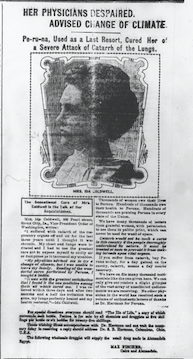

Mrs. Ida Caldwell, a seemingly sweet old lady has been suffering with “catarrh of the respiratory organs on and off for the last three years”. She had to use her greatest care not to “expose herself to chilly air or dampness as it increased her troubles.” She was advised to change her climate but she couldn’t leave her family so she had to stay put. Then she was introduced to Peruns which relieved her of her pain in three days, and she was completely cured in two months. What a miracle! This post seemed like a serious article about a well-known woman who seemed to be in a lot of pain due to her "catarrh of her lungs." However, when I kept reading, I noticed that it was just a gimmicky ad for a sketchy medicine that claimed to "cure symptoms of the common cold." The ad seemed really convincing, and I almost believed that this woman had her illness cured because of this medicine. On the downside, I did notice that this ad sounded a lot like the ones I hear today, which seems quite interesting, that advertisements haven’t changed that much since 1906. This was a very interesting, well put together ad, and I do believe that a lot of people would have jumped at the chance to buy this medicine upon reading this article.

