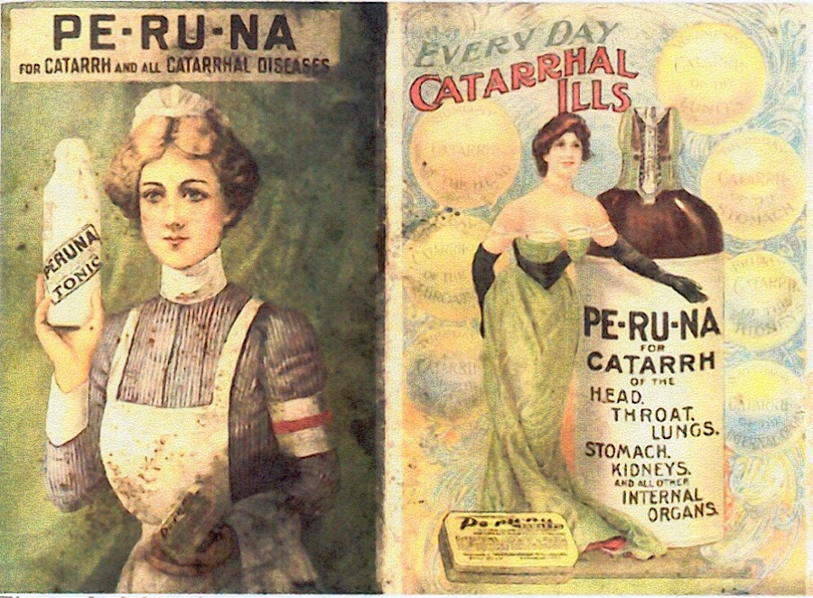

# Oldest Man in America - Madison Bolton

According to the Egyptian Gazette on March 15, 1905 there was a man named Mr. Isaac Brock, and he was 115 years old and claiming to be the oldest man in America.   Mr. Brock lived in McLennan County, Texas, and he accredited his old age of the use of a medicine called “Pe-ru-na.”  The article lists facts about Mr. Brock’s life including “born before the United States was formed, saw 22 Presidents elected, shod a horse when 99 years old.”  People were so mesmerized by the extent of Mr. Brock’s age that he even wrote a “lengthy biographical sketch,” and he was written about in the Dallas Morning News and the Chicago-Times.  Mr. Brock claims that Peruna protects him from sudden changes, and it is the greatest remedy for adapting to changes and the age of “catarrhal disease.”  Catarrhal diseases are what we call now Bronchitis or an excess of mucus.

According to the Egyptian Gazette on March 15, 1905 there was a man named Mr. Isaac Brock, and he was 115 years old and claiming to be the oldest man in America.   Mr. Brock lived in McLennan County, Texas, and he accredited his old age of the use of a medicine called “Pe-ru-na.”  The article lists facts about Mr. Brock’s life including “born before the United States was formed, saw 22 Presidents elected, shod a horse when 99 years old.”  People were so mesmerized by the extent of Mr. Brock’s age that he even wrote a “lengthy biographical sketch,” and he was written about in the Dallas Morning News and the Chicago-Times.  Mr. Brock claims that Peruna protects him from sudden changes, and it is the greatest remedy for adapting to changes and the age of “catarrhal disease.”  Catarrhal diseases are what we call now Bronchitis or an excess of mucus.

