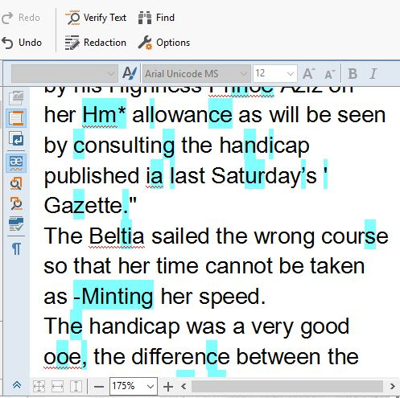

Although the whole process of learning new word processing and encoding programs was challenging, the most frustrating aspect was the [OCR]( https://www.abbyy.com/en-us/finereader/about-ocr/what-is-ocr/). It is supposed to be a faster way to translate the newspaper pages into plain text, it turned out to take up about as much time as it would have to hand type it all. I felt as if no matter how many times I scanned the [microfilm]( https://www.nedcc.org/free-resources/preservation-leaflets/6.-reformatting/6.1-microfilm-and-microfiche) images and changed the focus, brightness, contrast, or zoomed in on the page, it would not run through [ABBYY]( https://www.abbyy.com/en-us/) in the way I was expecting it to. I was hoping to have to make minimal corrections after the scanned images were OCRed, but with all the pages I have done up to this point, I have had to make a minimum of two hours’ worth of corrections per page. The word processing software may read a majority of the words (I would estimate around 85%), I still spent a majority of my time in this class fixing the mistakes the OCR made. I also found the other programs in this class easier to use than ABBYY. Sometimes while editing a word, the image it received it from would disappear, I also found the ordering of the paragraphs challenging at times. Overall, the program may have saved me some time, but another OCR processor may be more efficient, from my experience. 

