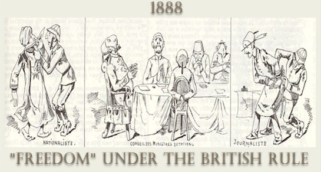

"The racist position became increasingly popular in the 1850s. In the 1860s it found a special home in the Anthropological Society of London, with the special patronage of James Hunt, From the 1890s to the first World War it reached the peak of its popularity, with almost universal acceptance in British scientific circles. “(P. D. Curtin, 1960.) 

I found this quote within the Journal of Historical Society of Nigeria, another country that entered the global theater as a colony of Britain. There is arguably no need for any research to be done to prove that racist ideals were held central in the British imperialist plan since it has found its way into common knowledge with Gandhi’s Indian revolution being a capstone. 

During this time period, science had moved its way into the forefront. Across the world there is a notable change in the way nearly everything is thought about and done. As exciting as this is for: technology, innovation, and the betterment of human-kind, science isn’t for everyone. The Anthropological Society of London (ASL) is such a group. Founded by an outspoken racist, and supporter of the Confederate States adherence to slave-labor practices, the ASL probably started off a little biased. Chapple in her article mentions the quick spread of Typhoid and the Bubonic plague. Light research shows that Typhoid was not an irregular occurrence in most parts of the world, and it was even vaccinated in 1896. I find this juxtaposed to Chapple’s [article](https://dig-eg-gaz.github.io/post/18-blog-chapple/), intriguing. 

I would argue that this medical advantage held by the Anglo-Saxon’s helped promote a wrongly-founded feeling racial superiority. The newspaper articulates this feeling and then uses science as proof of their racial superiority. The only issue with their science, is it isn’t science at all. The language used in the article and the arguments put forward follow a similar format. The author presents circumstances that would cause an empire to lose control over a colony, and then uses the stranglehold that Britain has to explain how they clearly aren’t a part of those circumstances. This dizzy circular reasoning is then accepted by its readers because honestly, no one thinks they're bad people.

Daniel Arena's does a great job presenting the blatant racism found within the briths empire [here](https://dig-eg-gaz.github.io/post/18-blog-arenas/)

# Links
Curtin, P. D. “‘SCIENTIFIC’ RACISM AND THE BRITISH THEORY OF EMPIRE.” Journal of the Historical Society of Nigeria, vol. 2, no. 1, 1960, pp. 40–51. JSTOR, www.jstor.org/stable/41970819.
